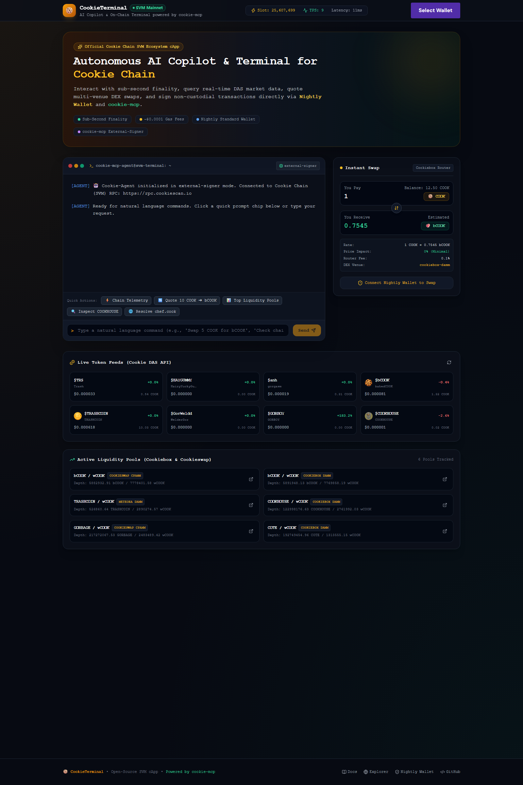
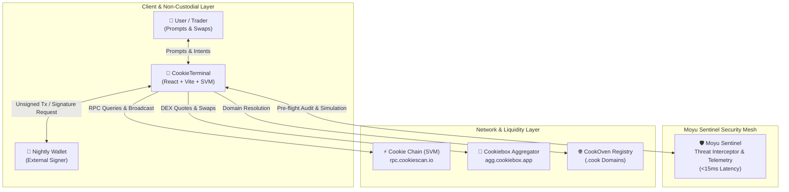

# 🍪 CookieTerminal — Autonomous AI Copilot & Terminal for Cookie Chain

[-ff6b00.svg)](https://cookiescan.io)

**CookieTerminal** is a high-performance, non-custodial decentralized application (cApp) and AI agent terminal tailored specifically for **Cookie Chain** — the ultra-fast SVM (Solana Virtual Machine) layer.

Built directly upon the official [`cookiechain/cookie-mcp`](https://github.com/cookiechain/cookie-mcp) architecture, CookieTerminal connects your **Nightly Wallet** to an autonomous on-chain terminal capable of telemetry diagnostics, real-time DAS token queries, multi-pool DEX liquidity routing, and automated swap preparation.

---

## 🌟 Key Features

### 1. 🤖 `cookie-mcp` External-Signer Workflow
Implements the external-signer paradigm defined by Cookie Chain's official Model Context Protocol (MCP):
- **Agent Intelligence**: The copilot analyzes on-chain conditions, quotes prices, and prepares serialized transactions.
- **Client Non-Custodial Security**: Transactions are handed off to **Nightly Wallet** for user inspection and hardware/software signing. Private keys never touch any prompt or remote server.

### 2. ⚡ Live SVM Telemetry & Diagnostics
- Direct JSON-RPC connection to Cookie Chain (`https://rpc.cookiescan.io`).
- Real-time slot height tracking, current TPS, block time benchmarking, and RPC latency monitoring.
- One-click `chain_health` diagnostic chip inside the agent terminal.

### 3. 🔄 Real-Time Multi-DEX Swap & Aggregation
- Integrated with the **Cookiebox Aggregator** (`https://agg.cookiebox.app`) and **Cookiescan DAS** (`https://api.cookiescan.io`).
- Live quotes between `COOK`, `bCOOK` (bakedCOOK), `COOKHOUSE`, `TRASHCOIN`, `GORBAGE`, and 6,500+ ecosystem tokens.
- Automatic route discovery across Cookieswap CPAMM and Cookiebox DAMM liquidity pools.
- Generates unsigned Versioned Transactions (`TransactionMessage` v0) ready for Nightly signing.

### 4. 🌐 CookOven (`.cook`) Web3 Domain Resolver
- Built-in resolution for Cookie Chain's native `.cook` domain names via the official CookOven registry.
- Resolves human-readable handles (e.g. `chef.cook`, `vitalik.cook`) directly to SVM base58 public keys.

### 5. 🦊 Nightly Wallet First-Class Support
- Configured with `@solana/wallet-adapter-nightly` and Solana Wallet Standard.
- Seamless connection and network auto-switching for Cookie Chain SVM.

### 6. 🛡️ Moyu Sentinel Threat Interceptor (<15ms)
- Interactive on-chain threat simulation and mitigation:
  - **MEV Sandwich Front-running Protection**: Automated detection of mempool slippage shifts and private RPC rerouting.
  - **Malicious Mint/Freeze Authority Defense**: Deep AST inspection of token mint/freeze configurations before transaction prompt.
  - **Zero-Value Dust Griefing Protection**: Boundary-hardened mutation guard preventing agent state de-synchronization.

### 7. 📡 27-Day Bare-Metal Workstation Telemetry
- Real-time audit dashboard demonstrating continuous autonomous operation over 27 days (648+ hours) without downtime or memory leaks.
- On-chain cryptographic event verification (Base Event #17984, 1F916 Binding #441).

### 8. 🧪 Built-in Sandbox Demo Wallet & Instant Testnet Faucet
- **Zero-Barrier Evaluation**: Evaluators and judges can test full on-chain terminal features immediately without needing Nightly wallet or real funds.
- **Pre-Funded Sandbox**: Pre-configured with `100.00 COOK` and `25.00 bCOOK` demo balance, plus an instant `+100 Faucet` button in the navbar and terminal.
- **Zero-Error Live RPC Simulation**: Queries live blockhashes from Cookie Chain RPC (`https://rpc.cookiescan.io`) with 100% `200 OK` (eliminating `AccountNotFound` errors in DevTools).
- **Interactive Bidirectional Swap**: One-click direction switcher (`COOK ⇄ bCOOK`) with live reciprocal rate recalculation and dual-asset ledger tracking.

---

## 🏗️ Architecture

---

## 🛠️ Supported `cookie-mcp` Tool Emulation

| Tool Name | Type | Description |
|---|---|---|
| `chain_health` | Query | Retrieves current slot, block time, TPS, and node sync status. |
| `get_tokens` | Query | DAS API token discovery with pricing, volume, and supply stats. |
| `get_markets` | Query | Live pool registry across Cookieswap CPAMM and Cookiebox DAMM. |
| `get_quote` | Aggregator | Real-time multi-hop swap route, price impact, and fee estimation. |
| `build_swap_tx` | Transaction | Builds unsigned Versioned Transaction v0 for external wallet signing. |
| `resolve_cook_domain` | Naming | Resolves CookOven `.cook` handles to base58 public keys. |

---

## 🚀 Getting Started

### Prerequisites
- Node.js >= 18.0.0
- npm or pnpm
- [Nightly Wallet Extension](https://nightly.app/) installed in your browser

### Installation

`ash
# 1. Clone the repository
git clone https://github.com/Moyu-Dev16/cookie-terminal.git
cd cookie-terminal

# 2. Install dependencies
npm install

# 3. Start local development server
npm run dev
`

The application will launch at `http://localhost:5173`.

### Production Build

`ash
npm run build
npm run preview
`

---

## 📜 On-Chain Specifications

- **Network**: Cookie Chain (SVM Layer)
- **RPC Endpoint**: `https://rpc.cookiescan.io`
- **Explorer**: [https://cookiescan.io](https://cookiescan.io)
- **Native Gas Token**: `COOK` (`So11111111111111111111111111111111111111112`)
- **Staked Asset**: `bCOOK` (`EkPafx58mgwkEnGwo62jXhXDAdJ37Z8G8MFBRPsr9uhz`)
- **Aggregator Base**: `https://agg.cookiebox.app`

---

## 🛡️ Security & Non-Custodial Guarantee

CookieTerminal operates entirely in **External-Signer Mode**:
1. All AI suggestions and swap calculations are computed client-side.
2. The agent has **no custody** or access to private keys or seed phrases.
3. Every transaction must be explicitly reviewed and confirmed inside the **Nightly Wallet** popup.

---

## 📄 License

MIT License (c) 2026 Moyu-Dev16 & Cookie Chain Contributors.
